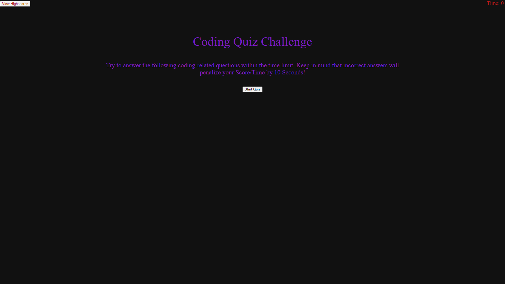

# Code-Quiz
This project involved making a game of sorts. It is a quiz game all about coding. The key requirements were making the page dynamically switch through the various questions and answers as well having a high scores page where the user could view the highest scores achieved in the game.

## "All The Small Things"
This project in particular was pretty tough. All the little things of making the page work dynamically and then, of course, all of those things colliding together to constantly break each other. Making sure that the quiz changed questions and answers, making sure a score was kept, making sure the scores and initials were stored right, it was issue after issue with this one. But in the end it all works just fine and the job is all done.

## Links

[Github Repository](https://github.com/JGuerrero126/Code-Quiz)

[The Website](https://jguerrero126.github.io/Code-Quiz/)

## Images/Screenshots

